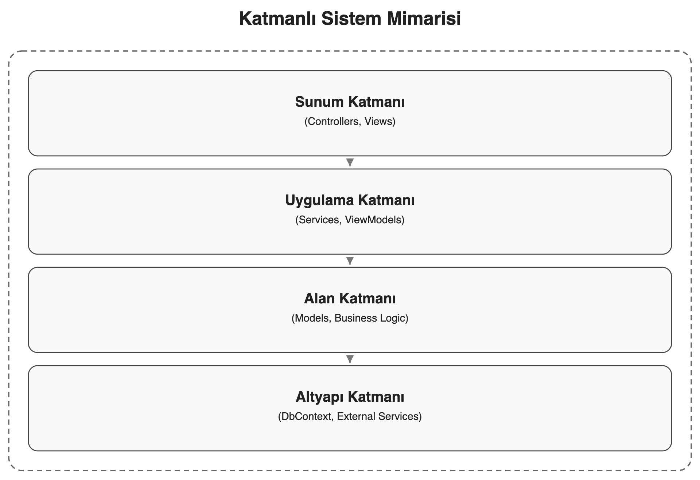
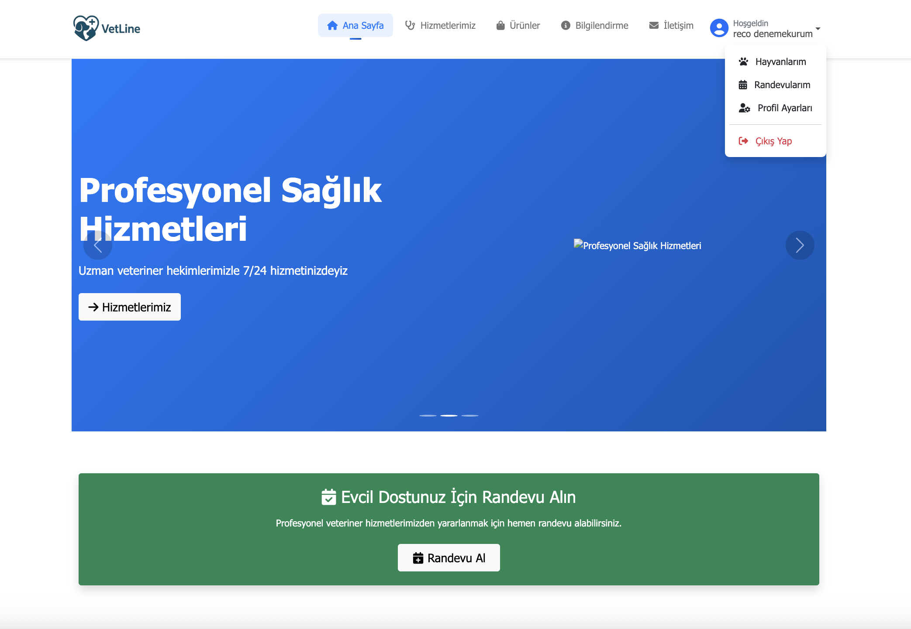
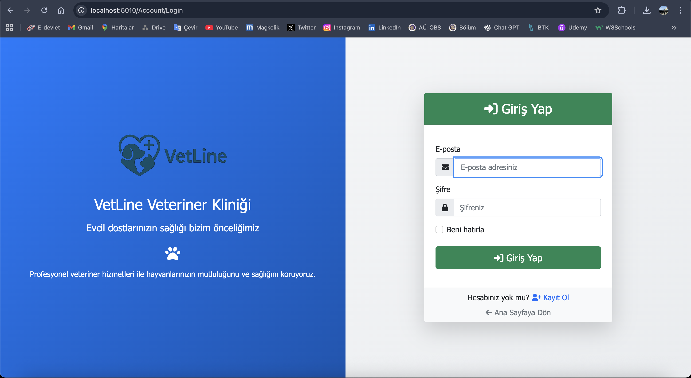
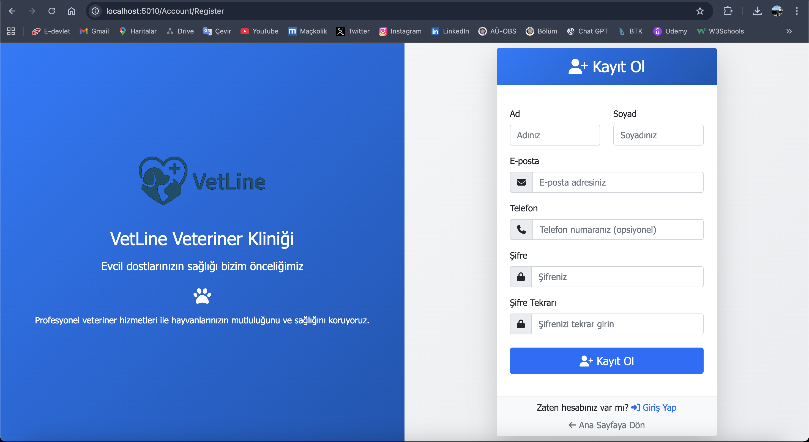
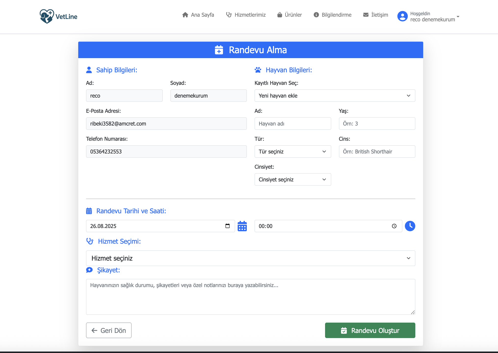
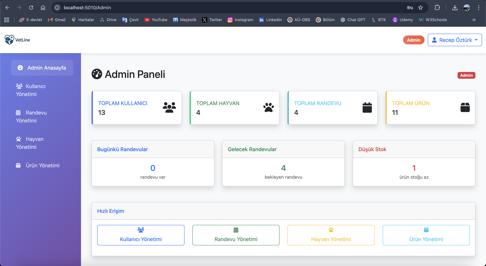
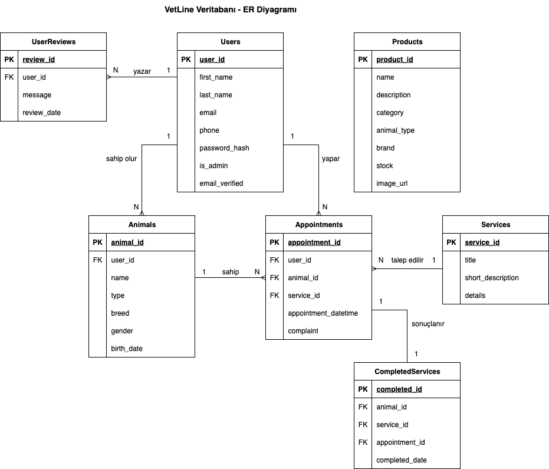

# 🐾 VetLine - Veteriner Kliniği Web Uygulaması

[](https://dotnet.microsoft.com/download/dotnet/8.0)
[](https://dotnet.microsoft.com/apps/aspnet)
[](https://docs.microsoft.com/en-us/ef/)
[](https://www.postgresql.org/)

## 📋 Proje Hakkında

VetLine, veteriner kliniği hizmetleri için geliştirilmiş modern ve kapsamlı bir web uygulamasıdır. ASP.NET Core 8.0 MVC mimarisi kullanılarak geliştirilen bu uygulama, veteriner kliniği işletmelerinin dijital dönüşümünü desteklemek amacıyla tasarlanmıştır.

**Bu proje, Cumhurbaşkanlığı Yazılım Daire Başkanlığı'nda yapılan staj kapsamında geliştirilmiştir.**

### 🎯 Ana Özellikler

- **👥 Kullanıcı Yönetimi**: Güvenli kayıt, giriş ve profil yönetimi
- **🐕 Hayvan Yönetimi**: Evcil hayvan bilgilerini saklama ve yönetme
- **📅 Randevu Sistemi**: Online randevu alma ve yönetimi
- **🏥 Hizmet Yönetimi**: Veteriner hizmetlerinin kataloglanması
- **💊 Ürün Yönetimi**: Veteriner ürünlerinin satışı
- **⭐ Değerlendirme Sistemi**: Kullanıcı yorumları ve puanlama
- **🔐 Admin Paneli**: Kapsamlı yönetim ve kontrol araçları
- **📧 Email Doğrulama**: JWT token tabanlı güvenli doğrulama

## 🏗️ Teknik Mimari

### Teknoloji Stack

- **Backend**: ASP.NET Core 8.0 MVC
- **Veritabanı**: PostgreSQL
- **ORM**: Entity Framework Core 8.0
- **Kimlik Doğrulama**: ASP.NET Core Identity
- **Email Servisi**: JWT token tabanlı doğrulama
- **Frontend**: HTML5, CSS3, JavaScript, Bootstrap 5
- **Validation**: Client-side ve server-side validation

### Mimari Yapı

```
VetLine/
├── Controllers/          # MVC Controller'ları
├── Models/              # Entity ve Domain modelleri
├── ViewModels/          # View için veri modelleri
├── Views/               # Razor view'ları
├── Services/            # Business logic servisleri
├── Migrations/          # Entity Framework migrations
└── wwwroot/            # Statik dosyalar (CSS, JS, Images)
```

### Katmanlı Sistem Mimarisi


## 🚀 Kurulum ve Çalıştırma

### Gereksinimler

- .NET 8.0 SDK
- PostgreSQL 15+
- Visual Studio 2022 veya VS Code

### Kurulum Adımları

1. **Repository'yi klonlayın**
   ```bash
   git clone https://github.com/kullaniciadi/VetLine.git
   cd VetLine
   ```

2. **Veritabanı bağlantısını yapılandırın**
   - `appsettings.json` dosyasında connection string'i güncelleyin
   - PostgreSQL veritabanını oluşturun

3. **Entity Framework migrations'ları çalıştırın**
   ```bash
   dotnet ef database update
   ```

4. **Uygulamayı çalıştırın**
   ```bash
   dotnet run
   ```

5. **Tarayıcıda açın**
   ```
   https://localhost:5001
   ```

## 📚 Staj Kapsamında Yapılan Araştırma Ödevleri

Staj sürecinde aşağıdaki konularda detaylı araştırma ödevleri tamamlanmıştır:

### 🔍 Araştırma Konuları

- **Container & Sanallaştırma**: Docker, Kubernetes ve container teknolojileri
- **Network**: Ağ protokolleri, güvenlik ve yönetim
- **SQL ve Algoritma**: Veritabanı optimizasyonu ve algoritma tasarımı
- **Database**: Veritabanı tasarım prensipleri ve best practices
- **Tanımlar**: Yazılım geliştirme süreçlerinde kullanılan temel kavramlar

### 📄 Ödev Dosyaları

- `Recep Öztürk - Container : Sanallaştırma Ödevi.docx`
- `Recep Öztürk - Network Ödevi.docx`
- `Recep Öztürk - SQL ve Algoritma Ödevi.docx`
- `Recep Öztürk - Database Ödevi.docx`
- `Recep Öztürk - Tanımlar Ödevi.docx`

## 📱 Ekran Görüntüleri

### Ana Sayfa


### Kullanıcı Girişi


### Kayıt Ol


### Profil Bilgileri


### Randevu Sistemi


### Admin Dashboard


## 🗄️ Veritabanı Yapısı

### Veritabanı Varlık-İlişki Modeli


### Ana Tablolar

- **users**: Kullanıcı bilgileri
- **animals**: Evcil hayvan bilgileri
- **appointments**: Randevu kayıtları
- **services**: Veteriner hizmetleri
- **products**: Veteriner ürünleri
- **user_reviews**: Kullanıcı değerlendirmeleri
- **completed_services**: Tamamlanan hizmetler

## 🔧 API Endpoints

### Kullanıcı İşlemleri
- `GET /Account/Register` - Kayıt sayfası
- `POST /Account/Register` - Kullanıcı kaydı
- `GET /Account/Login` - Giriş sayfası
- `POST /Account/Login` - Kullanıcı girişi
- `GET /Account/Profile` - Profil sayfası

### Randevu İşlemleri
- `GET /Appointments` - Randevu listesi
- `GET /Appointments/Create` - Randevu oluşturma
- `POST /Appointments/Create` - Randevu kaydetme
- `GET /Appointments/Details/{id}` - Randevu detayı

### Admin İşlemleri
- `GET /Admin` - Admin dashboard
- `GET /Admin/Users` - Kullanıcı yönetimi
- `GET /Admin/Appointments` - Randevu yönetimi
- `GET /Admin/Products` - Ürün yönetimi

## 🧪 Test

Uygulama test edilirken aşağıdaki senaryolar kullanılmıştır:

- **Unit Tests**: Model validation testleri
- **Integration Tests**: Controller action testleri
- **User Acceptance Tests**: Kullanıcı senaryoları
- **Security Tests**: Authentication ve authorization testleri

## 📋 Proje Dosyaları

### 📱 VetLine Web Uygulaması
- **VetLineApp/**: Ana web uygulaması projesi
- **VetLineMockUp.pdf**: Proje mockup ve tasarım dokümanı

### 📸 Ekran Görüntüleri
- **screenshots/**: Uygulama ekran görüntüleri ve diyagramlar

## 👨‍💻 Geliştirici

**Recep Öztürk** - [GitHub Profili](https://github.com/recepztrk)

**Staj Yeri**: Cumhurbaşkanlığı Yazılım Daire Başkanlığı

## 🙏 Teşekkürler

- ASP.NET Core ekibine
- Entity Framework ekibine
- Bootstrap ekibine
- Tüm open source topluluğuna
- Cumhurbaşkanlığı Yazılım Daire Başkanlığı ekibine

## 📞 İletişim

- **Email**: recep.ztrk.1907@gmail.com
- **GitHub**: [GitHub Profili](https://github.com/recepztrk)
- **LinkedIn**: [LinkedIn Profili](https://www.linkedin.com/in/recep-öztürk-45398525a)

---

⭐ Bu projeyi beğendiyseniz yıldız vermeyi unutmayın!

---

# 🎓 TCCB Staj Projeleri

Bu repository, Cumhurbaşkanlığı Yazılım Daire Başkanlığı'nda yapılan staj kapsamında geliştirilen projeler ve ek çalışmaları içermektedir.

## 📁 Repository İçeriği

- **VetLineApp/**: Veteriner kliniği web uygulaması
- **Araştırma Ödevleri/**: Staj sürecinde yapılan araştırma çalışmaları
- **screenshots/**: Proje ekran görüntüleri ve diyagramlar
- **VetLineMockUp.pdf**: Proje tasarım dokümanı

